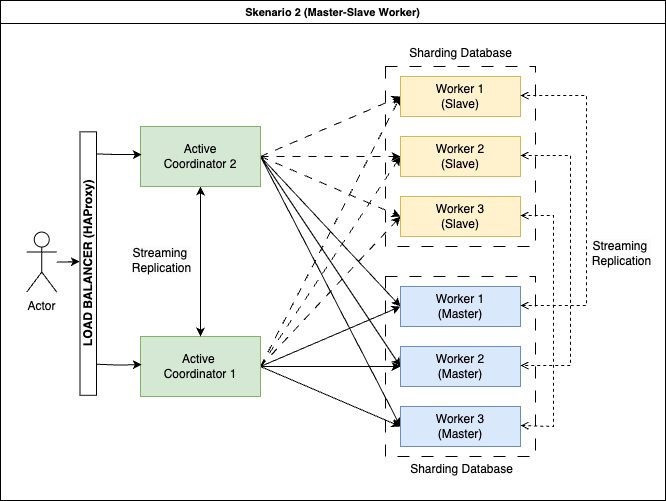

# Citus High-Availability Benchmarking Toolkit

A comprehensive toolkit for deploying and benchmarking a highly available PostgreSQL cluster using Citus with primary-secondary (master-slave) replication.

## Architecture

This project builds a distributed PostgreSQL cluster with:

- **Coordinator Layer**: Primary and secondary coordinators
- **Worker Layer**: Three worker nodes, each with primary and secondary instances
- **Load Balancer**: HAProxy for routing database connections
- **Monitoring**: Worker node monitoring and automatic failover
- **PostGIS Integration**: Spatial data capabilities on all nodes
- **Benchmarking Tools**: Locust-based read/write benchmarking



## Prerequisites

- Docker and Docker Compose
- Python 3.7+
- bash shell

## Quick Start

1. Clone the repository:
   ```
   git clone https://github.com/trmazayal/database-sharding-replication.git
   cd database-sharding-replication
   git checkout master-slave-worker
   ```

2. Start the cluster:
   ```
   ./run.sh
   ```

3. Wait for initialization (approx. 3-5 minutes)

4. Run benchmarks with the web UI:
   ```
   ./run_web_ui.sh
   ```
   Open http://localhost:8080 in your browser

## Components

### Docker Services

- **coordinator_primary/secondary**: Citus coordinator nodes
- **worker{1,2,3}_primary/secondary**: Distributed worker nodes
- **loadbalancer**: HAProxy for connection routing
- **worker_monitor**: Automated failover monitoring
- **manager**: Initial cluster setup

### Benchmarking Tools

- **read_benchmark.sh**: Read-only workload testing
- **write_benchmark.sh**: Write-only workload testing
- **mixed_benchmark.sh**: Combined read/write testing with configurable ratios
- **run_locust_benchmark.sh**: Core benchmarking script with Locust
- **web_ui.py**: Interactive web interface for running benchmarks

## Running Benchmarks

### Via Web UI

1. Start the web UI:
   ```
   ./run_web_ui.sh
   ```

2. Open http://localhost:8080 in your browser
3. Configure benchmark parameters:
   - Number of users
   - Spawn rate
   - Run time
   - Benchmark type (read, write, mixed)
   - Read/write ratio for mixed benchmarks
4. View real-time results and download reports

### Via Command Line

Run specific benchmark types:

```bash
# Read-only benchmark
./read_benchmark.sh

# Write-only benchmark
./write_benchmark.sh

# Mixed workload (80% read, 20% write)
READ_RATIO=80 WRITE_RATIO=20 ./mixed_benchmark.sh

# Custom parameters
USERS=200 SPAWN_RATE=20 RUN_TIME=120 ./run_locust_benchmark.sh
```

## High Availability Testing

The cluster includes automatic failover for worker nodes:

1. Monitor the failover process:
   ```
   docker logs -f citus_worker_monitor
   ```

2. Simulate worker primary failure:
   ```
   docker stop citus_worker1_primary
   ```

3. Observe the automatic promotion of the secondary to primary

## Customization

### Changing Workload Distribution

Edit the READ_WEIGHT and WRITE_WEIGHT environment variables to adjust the read/write ratio:

```bash
READ_WEIGHT=60 WRITE_WEIGHT=40 ./run_locust_benchmark.sh
```

### Scaling Users

Modify the USERS and SPAWN_RATE parameters to simulate different loads:

```bash
USERS=500 SPAWN_RATE=50 ./read_benchmark.sh
```

## Troubleshooting

### Connection Issues

If the benchmark can't connect to the database:

```bash
docker exec -it citus_loadbalancer psql -h localhost -U citus -d citus
```

### Replication Problems

Check replication status:

```bash
docker exec -it citus_coordinator_primary psql -U citus -c "SELECT * FROM pg_stat_replication;"
```

### Log Access

View logs for specific components:

```bash
# Coordinator logs
docker logs citus_coordinator_primary

# Worker logs
docker logs citus_worker1_primary

# Monitor logs
docker logs citus_worker_monitor
```

## License

[MIT License](LICENSE)
