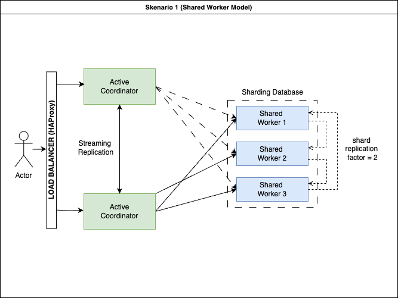

# Citus High-Availability Benchmarking Toolkit

A comprehensive toolkit for deploying and benchmarking a highly available PostgreSQL cluster using Citus with primary-secondary replication.

## Architecture

This project builds a distributed PostgreSQL cluster with:

- **Coordinator Layer**: Primary and secondary coordinators for high availability
- **Worker Layer**: Three worker nodes with logical replication (using shard replication factor)
- **Load Balancer**: HAProxy for connection routing between coordinators
- **PostGIS Integration**: Spatial data capabilities on all nodes
- **Benchmarking Tools**: Locust-based tools for performance testing



## Prerequisites

- Docker and Docker Compose
- Python 3.7+
- bash shell

## Quick Start

1. Clone the repository:
   ```
   git clone https://github.com/trmazayal/database-sharding-replication.git
   cd database-sharding-replication
   git checkout shared-worker-model
   ```
2. Make the scripts executable:
   ```
   chmod +x *.sh
   ```

3. Start the cluster:
   ```
   ./run.sh
   ```

4. Wait for initialization (approx. 3-5 minutes)

5. Run benchmarks with the web UI:
   ```
   ./run_web_ui.sh
   ```
   Open http://localhost:8080 in your browser

## Components

### Docker Services

- **coordinator_primary/secondary**: Citus coordinator nodes
- **worker{1,2,3}**: Distributed worker nodes
- **loadbalancer**: HAProxy for connection routing
- **manager**: Initial cluster setup and configuration

### Benchmarking Tools

- **read_benchmark.sh**: Read-only workload testing
- **write_benchmark.sh**: Write-only workload testing
- **mixed_benchmark.sh**: Combined read/write testing with configurable ratios
- **run_locust_benchmark.sh**: Core benchmarking script with Locust
- **web_ui.py**: Interactive web interface for running benchmarks

## Running Benchmarks

### Via Web UI

1. Start the web UI:
   ```
   ./run_web_ui.sh
   ```

2. Open http://localhost:8080 in your browser
3. Configure benchmark parameters:
   - Number of users
   - Spawn rate
   - Run time
   - Benchmark type (read, write, mixed)
   - Read/write ratio for mixed benchmarks
4. View real-time results and download reports

### Via Command Line

Run specific benchmark types:

```bash
# Read-only benchmark
./read_benchmark.sh

# Write-only benchmark
./write_benchmark.sh

# Mixed workload (80% read, 20% write)
READ_RATIO=80 WRITE_RATIO=20 ./mixed_benchmark.sh

# Custom parameters
USERS=200 SPAWN_RATE=20 RUN_TIME=120 ./run_locust_benchmark.sh
```

## Benchmark Customization

### Adjusting User Load

```bash
# Modify user count and spawn rate
USERS=500 SPAWN_RATE=50 RUN_TIME=300 ./read_benchmark.sh
```

### Changing Read/Write Workload Distribution

```bash
# Change the read/write ratio for mixed benchmarks
READ_RATIO=60 WRITE_RATIO=40 ./mixed_benchmark.sh
```

## Monitoring and Results

Benchmark results are saved to the `benchmark_results` directory:

- JSON metrics with detailed performance data
- Log files with request-level information
- Timestamp-based directories for organizing multiple test runs

Use the web UI's "Results" page to:
- View historical benchmark results
- Compare multiple benchmark runs
- Download result files for external analysis

## Database Schema

The benchmark uses a `vehicle_locations` table with PostGIS geometry:

```sql
CREATE TABLE vehicle_locations (
  id bigserial,
  vehicle_id int NOT NULL,
  location geometry(Point, 4326) NOT NULL,
  recorded_at timestamptz NOT NULL,
  region_code text NOT NULL
);
```

This table is distributed across worker nodes using the `region_code` column.

## Troubleshooting

### Connection Issues

If the benchmark can't connect to the database:

```bash
docker exec -it citus_loadbalancer psql -h localhost -U citus -d citus
```

### Replication Problems

Check replication status:

```bash
docker exec -it citus_coordinator_primary psql -U citus -c "SELECT * FROM pg_stat_replication;"
```

### Log Access

View logs for specific components:

```bash
# Coordinator logs
docker logs citus_coordinator_primary

# Worker logs
docker logs citus_worker1

# Load balancer logs
docker logs citus_loadbalancer
```

## License

[MIT License](LICENSE)
